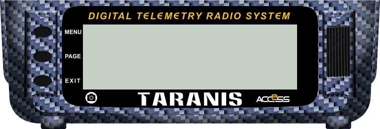

# "Taranis X9D+ 2019" dark blue skin for the Companion simulator  

## The different parts of the image

The image is divided into 4 pieces: top, bottom, left and right. 
For the images concerned, there is the version with the activated element and the version without the activated element (such as a button, a rotary encoder, clicking on the rotary encoder).

|     File name        | What is this image ?                          |
|:---------------------|:----------------------------------------------|
| `bottom.png`         | central lower band                            |
| `center_LCD.png`     | central LCD 424x128px (useless for simulator) |
| `left.png`           | left part with inactive elements              |
| `left_exit.png`      | left part with the EXIT button activated      |
| `left_menu.png`      | left part with the MENU button activated      |
| `left_page.png`      | left part with the PAGE button activated      |
| `bottom_scrnshot.png`| central lower band with the SCREENSHOT button activated|
| `right_ent.png`      | right part with the ENTER button activated    |
| `right.png`          | right part with inactive elements             |
| `top.png`            | central upper band                            |

`X9DP2019_Companion_image.png` is the image displayed here.

## Software used :
- **Inkscape** : vector drawing software (http://www.inkscape.org/)
- **Gimp** : image editor (http://www.gimp.org/)